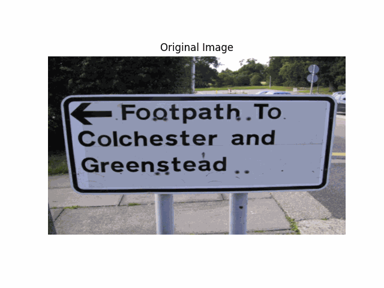

# 📖 Text Detection Model (CRAFT Implementation)

## 🚀 Overview  
This project is my **from-scratch implementation** of the research paper:  
**“Character Region Awareness for Text Detection” (CRAFT, CVPR 2019).**  

The model detects **text regions at the character level** and links them into words, making it powerful for **scene text detection** and **OCR preprocessing**.  

Working on this project **really helped me a lot in my learning**, as I understood how to read a research paper and translate it into working code.

---

## 🧠 Key Features  
- ✅ Implemented **directly from the CRAFT paper**, step by step.  
- ✅ **From Scratch**: No shortcuts — built everything myself.  
- ✅ **Character-level detection** with text/affinity maps.  
- ✅ Handles **curved and multi-scale text** effectively.  

---

## 🎥 Demo  

Here’s the model in action:  

  

---

## 📊 Dataset  
- Trained on publicly available **scene text detection datasets**.  
- Used data augmentation: **rotation, scaling, noise, cropping**.  
- Preprocessing with **resizing + normalization** as suggested in the paper.  

---

## 🏗️ Model Highlights  
- **Backbone**: CNN feature extractor (similar to VGG-16).  
- **Outputs**:  
  - Text region score map (where text exists).  
  - Affinity score map (links characters into words).  
- **Post-processing**: Thresholding + connected components to extract boxes.  

---

